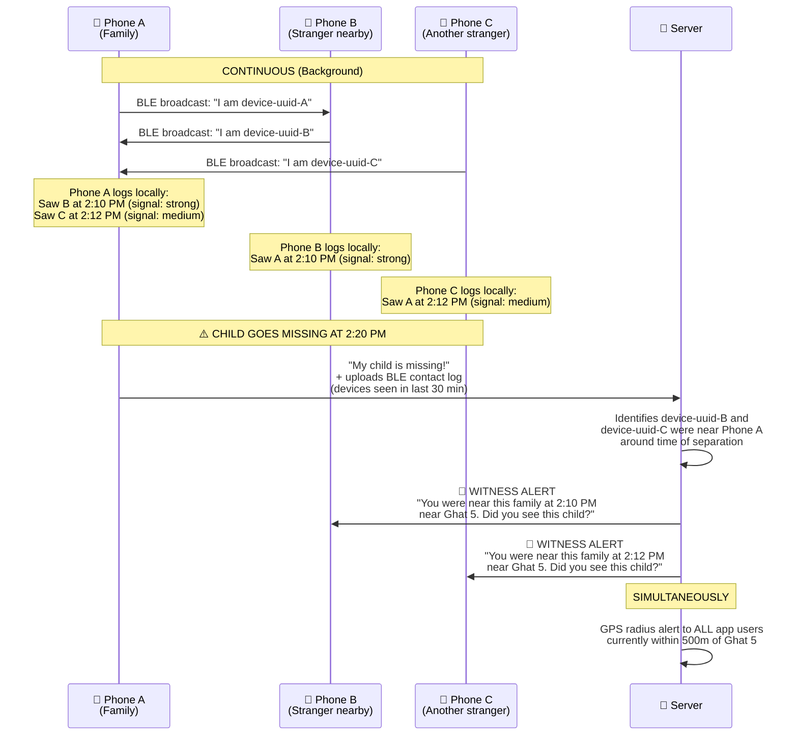
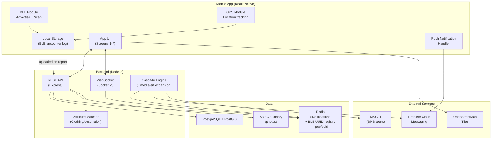

# KumbhRaksha — App Implementation Plan

> **Focus**: The citizen app with BLE proximity as the core innovation.
> **Key Insight**: Don't just alert people *near a location* — alert people who were *near the person*.

---

## Why BLE Proximity Changes Everything

GPS radius alerts say: *"You are currently near where someone went missing."*
BLE proximity says: *"You were standing next to this person 10 minutes ago. Did you see where they went?"*

The difference is **witnesses vs. bystanders**. Witnesses are 100x more useful.

```
┌──────────────────────────────────────────────────────────────┐
│                    THE TWO ALERT MODES                        │
├──────────────────────────────────────────────────────────────┤
│                                                              │
│  MODE 1: BLE PROXIMITY (Witness Alert)                       │
│  ─────────────────────────────────────                       │
│  "Your phone was within 10m of this person's family          │
│   at 2:15 PM near Ghat 5. They are now missing.             │
│   Did you see a 7-year-old boy in a blue t-shirt?"          │
│                                                              │
│  → Targets people who WERE THERE                             │
│  → They might have seen the person wander off                │
│  → They might have seen which direction they went            │
│  → Highest quality leads                                     │
│                                                              │
├──────────────────────────────────────────────────────────────┤
│                                                              │
│  MODE 2: GPS RADIUS (Area Alert)                             │
│  ───────────────────────────────                             │
│  "A 7-year-old boy in a blue t-shirt is missing             │
│   near Ghat 5. Last seen 15 minutes ago."                   │
│                                                              │
│  → Targets people who ARE NEARBY NOW                         │
│  → They can actively look around them                        │
│  → Casts a wider net                                         │
│  → Volume play — more eyes searching                         │
│                                                              │
└──────────────────────────────────────────────────────────────┘

Both fire simultaneously. BLE finds witnesses. GPS finds searchers.
```

---

## How BLE Proximity Works (End-to-End)

Inspired by COVID contact tracing, but repurposed for finding people:



### What each phone does in the background:

```
Every 4 seconds:
├── ADVERTISE: Broadcast a rotating UUID via BLE
│   (identifies this phone as a KumbhRaksha user)
│
├── SCAN: Listen for other KumbhRaksha UUIDs nearby
│   (low-power mode to save battery)
│
└── LOG locally: Store encounters
    {
      "encountered_uuid": "abc-123",
      "timestamp": "2025-01-29T14:10:32",
      "rssi": -45,           // signal strength → approximate distance
      "my_location": [25.431, 81.846]  // GPS at time of encounter
    }
    
    Rolling 2-hour window. Older entries auto-deleted.
    Stored ONLY on device. Never uploaded unless a report is filed.
```

> [!IMPORTANT]
> **Privacy by design**: BLE logs are stored locally and NEVER leave the phone unless the user actively files a missing person report. Only then does the reporter's contact log get uploaded — and it contains only anonymous device UUIDs, not names or identities. The server matches UUIDs to push tokens to send alerts, but never reveals identities between users.

---

## Why Native App, Not PWA

BLE proximity **requires a native app**. This is non-negotiable:

| Capability | PWA (Web Bluetooth) | Native (React Native) |
|---|---|---|
| BLE background scanning | ❌ Impossible | ✅ With foreground service |
| BLE advertising (broadcast) | ❌ Impossible | ✅ Full control |
| Beacon detection | ❌ No raw advertisement access | ✅ Full access |
| Background operation | ❌ Suspended when tab hidden | ✅ Foreground service keeps alive |
| iOS support | ❌ Safari blocks Web Bluetooth | ✅ CoreBluetooth works |
| Push notifications | ⚠️ Limited | ✅ FCM / APNs |

**Decision: React Native app** (single codebase for Android + iOS) with `react-native-ble-plx` for BLE and a foreground service for background operation.

> [!TIP]
> For users who don't want to install the app, we keep a **lightweight web fallback** — a simple page where they can report missing persons and view alerts. No BLE, just GPS-based. But the real power is in the native app.

---

## App Screens (Detailed)

### Screen 1: Onboarding (First Launch Only)

```
┌─────────────────────────────┐
│                             │
│    🙏 KumbhRaksha           │
│    Protecting Every Pilgrim │
│                             │
│  ┌───────────────────────┐  │
│  │  This app helps find  │  │
│  │  missing people at    │  │
│  │  Kumbh Mela. Your     │  │
│  │  phone becomes part   │  │
│  │  of a search network. │  │
│  └───────────────────────┘  │
│                             │
│  We need 3 permissions:     │
│                             │
│  📍 Location                │
│  → To alert you about       │
│    nearby missing persons   │
│                             │
│  📡 Bluetooth               │
│  → To detect if you were    │
│    near a missing person    │
│                             │
│  🔔 Notifications           │
│  → To alert you instantly   │
│                             │
│  [ Enable & Protect  🛡️ ]   │
│                             │
│  Preferred language: [Hindi ▼] │
│                             │
└─────────────────────────────┘
```

**Key decisions:**
- Single permission screen, not three separate — reduces drop-off
- Frame it as protection/service, not surveillance
- Hindi default, switchable to English + 8 regional languages
- Phone number verification via OTP (for accountability and contact)

---

### Screen 2: Home — Alert Feed

```
┌─────────────────────────────┐
│ 📍 Sector 5, Ghat Area       │
│ ─────────────────────────── │
│                             │
│ ⚡ WITNESS ALERT             │
│ ┌───────────────────────┐   │
│ │ 👦 Rahul, 7 yrs       │   │
│ │ Blue Shiva t-shirt,   │   │
│ │ orange shorts          │   │
│ │                       │   │
│ │ 📍 You were 8m from   │   │
│ │ his family at 2:10 PM │   │
│ │                       │   │
│ │ Missing since: 2:20PM │   │
│ │ ⏱️ 12 min ago          │   │
│ │                       │   │
│ │ [👁️ I See Them]       │   │
│ │ [📍 I Was There]      │   │
│ └───────────────────────┘   │
│                             │
│ 🔍 AREA ALERTS              │
│ ┌───────────────────────┐   │
│ │ 👵 Kamla Devi, ~70 yrs│   │
│ │ White saree, walking  │   │
│ │ stick, no teeth       │   │
│ │ 📍 350m from you      │   │
│ │ ⏱️ 25 min ago          │   │
│ │ [👁️ I See Them]       │   │
│ └───────────────────────┘   │
│                             │
│ ┌───────────────────────┐   │
│ │ 🧒 Unknown child ~4yr │   │
│ │ SIGHTING by citizen   │   │
│ │ Crying alone, red     │   │
│ │ kurta, near food stall│   │
│ │ 📍 120m from you      │   │
│ │ [🏃 Guide to help]    │   │
│ └───────────────────────┘   │
│                             │
│         [➕ Report]          │
│  [🗺️ Map] [🏠] [👤 Profile] │
└─────────────────────────────┘
```

**Two tiers of alerts:**
- **⚡ Witness Alerts** (BLE-matched): Pinned to top, highlighted, louder notification sound. These users were physically near the family.
- **🔍 Area Alerts** (GPS radius): Standard cards sorted by distance. These users are currently in the area.

**Actions on each card:**
- **"I See Them"** → Opens camera for confirmation photo + shares GPS
- **"I Was There"** → For witness alerts: "I remember seeing them, they went toward [direction picker]". Even partial memory helps.
- **"Guide to help"** → For sighted-but-unclaimed children: walking directions to the child's location

---

### Screen 3: Report Missing Person

```
┌─────────────────────────────┐
│ ← Report Missing Person     │
│ ─────────────────────────── │
│                             │
│ 📸 [Take Photo] [Gallery]   │
│  (or skip if no photo)      │
│                             │
│ Name: [Rahul Singh        ] │
│ Age:  [7   ] Gender: [M ▼] │
│                             │
│ 👕 What are they wearing?   │
│ ┌───────────────────────┐   │
│ │ Top: [Blue] [T-shirt▼]│   │
│ │ Bottom: [Orange][Shorts]│  │
│ │ Footwear: [Slippers ▼]│   │
│ │ Extras: [Red thread   ]│   │
│ └───────────────────────┘   │
│                             │
│ 📏 Build: [Thin ▼]          │
│ 🗣️ Language: [Hindi ▼]      │
│                             │
│ 🏥 Medical: [None         ] │
│ (e.g., needs medication,    │
│  hearing impaired, etc.)    │
│                             │
│ 📍 Where did you last see   │
│    them?                    │
│ [📍 Use current location]   │
│ [🗺️ Pin on map]             │
│                             │
│ 🕐 When did you last see    │
│    them?                    │
│ [Just now] [15m ago]        │
│ [30m ago] [1hr+ ago]        │
│                             │
│ 📞 Your phone: [Auto-filled]│
│ 🧑‍🤝‍🧑 Relation: [Parent ▼]    │
│                             │
│ [🚨 Submit Report]          │
│                             │
│ ⚡ Your BLE contact log     │
│ (last 2 hrs) will be shared │
│ to alert witnesses.         │
│                             │
└─────────────────────────────┘
```

**Key design choices:**
- **Structured clothing fields** (color + type dropdowns) instead of free text — enables machine matching against sightings
- **Quick time buttons** instead of a time picker — panicked parents can't think in clock time
- **BLE log upload notice** — transparency about what data is shared
- **Photo is optional** — the plan doesn't depend on having one

---

### Screen 4: Report a Sighting (Flow B)

```
┌─────────────────────────────┐
│ ← I See Someone Lost        │
│ ─────────────────────────── │
│                             │
│ 📸 [Take Photo of Them]     │
│                             │
│ Quick description:          │
│ 👶 Child  👵 Elderly         │
│ 👨 Adult  ♿ Disabled        │
│                             │
│ Gender: [F ▼]               │
│ Approx age: [~70  ]        │
│                             │
│ What are they doing?        │
│ [😢 Crying]  [😶 Confused]  │
│ [🧍 Standing alone]         │
│ [🚶 Wandering]              │
│                             │
│ 📍 Location: [Auto-detected]│
│                             │
│ Brief note (optional):      │
│ [Elderly woman sitting near ]│
│ [tea stall, looks distressed]│
│                             │
│ [📤 Submit Sighting]         │
│                             │
│ 💡 Stay with them if safe.  │
│ Authorities will be alerted.│
│                             │
└─────────────────────────────┘
```

**Flow B is critical** because:
- The sighting CREATES the photo (the report might not have one)
- The person may not have been reported yet — this is proactive
- The spotter can stay with the person, becoming a live GPS pin for responders

---

### Screen 5: Active Alerts Map

```
┌─────────────────────────────┐
│ ← Live Map                  │
│ ─────────────────────────── │
│                             │
│ ┌───────────────────────┐   │
│ │                       │   │
│ │    🔴 ← Active case   │   │
│ │   ╱  ╲  (pulsing)     │   │
│ │  ╱ 500m╲              │   │
│ │ ╱  ring  ╲            │   │
│ │╱──────────╲           │   │
│ │            📸 📸       │   │
│ │  📍(you)    📸        │   │
│ │        🟡 ← Sighting  │   │
│ │    📸                 │   │
│ │  📸    📸              │   │
│ │       🔴              │   │
│ └───────────────────────┘   │
│                             │
│ Layers:                     │
│ [✅ Missing] [✅ Sightings] │
│ [☐ CCTV cameras]           │
│ [☐ Crowd density]          │
│                             │
│ Tap any marker for details  │
│                             │
└─────────────────────────────┘
```

- 🔴 Missing person markers with expanding radius rings (animated)
- 🟡 Unverified sightings
- 📸 CCTV camera positions (from dataset) — togglable layer
- 🌡️ Crowd density heatmap — togglable layer
- Tap any marker → slides up detail card with actions

---

### Screen 6: "I See Them" Confirmation Flow

```
┌─────────────────────────────┐
│ ← Confirm Sighting          │
│ ─────────────────────────── │
│                             │
│ You're reporting that you   │
│ see: Rahul, 7 yrs           │
│ Blue t-shirt, orange shorts │
│                             │
│ ┌───────────────────────┐   │
│ │                       │   │
│ │    📷 Camera View     │   │
│ │                       │   │
│ │   [📸 Take Photo]     │   │
│ │                       │   │
│ └───────────────────────┘   │
│                             │
│ How confident are you?      │
│ [😐 Maybe] [😊 Likely]      │
│ [✅ Definitely them]        │
│                             │
│ Can you stay with them?     │
│ [Yes — share my live 📍]    │
│ [No — just reporting]       │
│                             │
│ [📞 Call Family (masked #)] │
│                             │
│ [✅ Submit Confirmation]    │
│                             │
└─────────────────────────────┘
```

- If they choose "stay with them" → app shares live GPS with dashboard until closed
- Family gets notified: *"A citizen has spotted someone matching Rahul's description at [location]. Verification in progress."*
- Authority dashboard gets a high-priority ping

---

### Screen 7: Family Group & Self-Registration

```
┌─────────────────────────────┐
│ ← My Family Group           │
│ ─────────────────────────── │
│                             │
│ 👨 Rajesh (You)    📍 Live  │
│ 👩 Sunita          📍 Live  │
│ 👦 Rahul           📍 Live  │
│ 👵 Kamla Ma        ❌ No app │
│                             │
│ [➕ Add Family Member]       │
│                             │
│ For members WITHOUT a phone:│
│ ┌───────────────────────┐   │
│ │ 📸 Photo              │   │
│ │ Name, Age, Description│   │
│ │ What they're wearing  │   │
│ │ Medical conditions    │   │
│ │                       │   │
│ │ If they go missing,   │   │
│ │ one-tap to report     │   │
│ │ with all info pre-    │   │
│ │ filled.               │   │
│ └───────────────────────┘   │
│                             │
│ For members WITH a phone:   │
│ 📲 Share invite link        │
│ → Linked accounts can see   │
│   each other's live location│
│                             │
│ [🔊 Family Audio Beacon]    │
│ Choose a sound your family  │
│ will recognize: [Melody 3 ▼]│
│                             │
└─────────────────────────────┘
```

**Pre-registration is the multiplier:**
- Registering Kamla Ma (who has no phone) means if she goes missing, reporting takes **10 seconds** — one tap, all info pre-filled, photo already uploaded
- Family members with the app can see each other's live location (like Google Maps sharing)
- **Audio Beacon**: Family picks a unique melody. If someone goes missing, nearby searchers' phones can play that melody. The lost person hears it and moves toward the sound.

---

## Authority Dashboard (Companion)

The dashboard is simpler since the app is the focus. Four views:

### View 1: Live Operations Map
- All active cases, sightings, and responder positions
- CCTV camera overlay from dataset
- Crowd density heatmap from app user distribution
- Click any case → detail panel

### View 2: Case Management
- Case table with status pipeline
- For each case:
  - **Witness list**: Phones that were BLE-proximate to the reporter at time of separation (with alert status: notified / responded / no response)
  - **Sightings**: Citizen-submitted sightings linked to this case
  - **Alert history**: Radius expansions, how many notified
  - **Timeline**: Every action taken

### View 3: Alert Controls
- Override cascade timing (accelerate/decelerate)
- Manual area broadcast (draw on map)
- SMS blast trigger for critical cases
- View BLE encounter graph: *"These 14 phones were near the reporter between 2:00-2:20 PM"*

### View 4: Analytics
- Cases by zone, age, time
- Avg reunion time
- BLE witness response rate
- Most common separation zones

---

## Technical Architecture



### Core BLE Implementation

```
React Native App
│
├── BLE Advertiser (react-native-ble-plx)
│   ├── Broadcasts: KumbhRaksha service UUID
│   ├── Payload: Device's unique rotating ID (changes every 15 min)
│   └── Runs in: Android Foreground Service / iOS Background Mode
│
├── BLE Scanner (react-native-ble-plx)  
│   ├── Filters: Only KumbhRaksha service UUID
│   ├── Mode: ScanMode.LowPower (saves battery)
│   ├── Logs: { uuid, rssi, timestamp, gps } → SQLite
│   └── Retention: Rolling 2-hour window
│
├── Encounter Log (local SQLite)
│   ├── Never leaves device unless user files a report
│   ├── On report: Upload encounters from [last_seen_time - 30min] to [now]
│   └── Server matches UUIDs → FCM push tokens → sends Witness Alerts
│
└── Foreground Service (Android)
    ├── Persistent notification: "🛡️ KumbhRaksha is protecting pilgrims"
    ├── Keeps BLE scan alive when app is minimized
    └── Battery impact: ~3-5% per day (comparable to fitness trackers)
```

### The Core Query (Finding Witnesses)

When a report comes in with BLE encounter data:

```sql
-- Reporter uploads their encounter log. For each encountered UUID:

-- 1. Find which app user owns that UUID
SELECT user_id, fcm_token 
FROM ble_uuid_registry 
WHERE rotating_uuid = '<encountered_uuid>'
  AND valid_from <= '<encounter_timestamp>'
  AND valid_until >= '<encounter_timestamp>';

-- 2. Send Witness Alert via FCM to those users

-- SIMULTANEOUSLY, GPS radius alert:
SELECT user_id, fcm_token
FROM user_locations
WHERE ST_DWithin(
    location::geography,
    ST_MakePoint(<last_seen_lng>, <last_seen_lat>)::geography,
    500  -- 500 meters
)
AND location_updated_at > NOW() - INTERVAL '5 minutes';
```

---

## Battery & Performance

Honest numbers:

| Component | Battery Impact | Mitigation |
|---|---|---|
| BLE Advertising | ~1-2%/day | Low-power mode, 4s interval |
| BLE Scanning | ~2-3%/day | `ScanMode.LowPower`, filtered by service UUID |
| GPS (background) | ~3-5%/day | Significant-change mode, not continuous |
| **Total** | **~6-10%/day** | Comparable to running Google Maps in background |

> [!WARNING]
> **iOS caveat**: iOS suspends BLE scanning more aggressively. Scanning works reliably when the app is backgrounded (minimized), but NOT when the app is force-killed (swiped away). The onboarding should educate users: *"Keep the app running in the background for the best protection."* On Android, the foreground service prevents this issue.

---

## Data Model

```sql
-- BLE UUID rotation (privacy)
CREATE TABLE ble_uuid_registry (
    id UUID PRIMARY KEY,
    user_id UUID REFERENCES app_users(id),
    rotating_uuid VARCHAR(36) NOT NULL,
    valid_from TIMESTAMP NOT NULL,
    valid_until TIMESTAMP NOT NULL,
    fcm_token TEXT
);

-- BLE encounter log (uploaded only on report)
CREATE TABLE ble_encounters (
    id UUID PRIMARY KEY,
    reporter_id UUID REFERENCES app_users(id),
    missing_report_id UUID REFERENCES missing_reports(id),
    encountered_uuid VARCHAR(36),
    rssi INTEGER,              -- signal strength → distance estimate
    encounter_time TIMESTAMP,
    encounter_location GEOMETRY(Point, 4326),
    witness_user_id UUID,      -- resolved after upload
    alert_sent BOOLEAN DEFAULT FALSE,
    witness_responded BOOLEAN DEFAULT FALSE
);

-- Missing report with structured clothing
CREATE TABLE missing_reports (
    id UUID PRIMARY KEY,
    reporter_id UUID REFERENCES app_users(id),
    person_name VARCHAR(100),
    person_age INTEGER,
    person_gender VARCHAR(10),
    photo_url TEXT,
    -- Structured clothing (for machine matching)
    clothing_top_color VARCHAR(30),
    clothing_top_type VARCHAR(30),
    clothing_bottom_color VARCHAR(30),
    clothing_bottom_type VARCHAR(30),
    clothing_footwear VARCHAR(30),
    clothing_extras TEXT,
    -- Physical
    build VARCHAR(20),
    distinguishing_features TEXT,
    language_spoken VARCHAR(30),
    medical_conditions TEXT,
    -- Location & time
    last_seen_location GEOMETRY(Point, 4326),
    last_seen_time TIMESTAMP,
    reported_at TIMESTAMP DEFAULT NOW(),
    -- Status
    status VARCHAR(20) DEFAULT 'reported',
    cascade_level INTEGER DEFAULT 1,
    alert_radius_meters INTEGER DEFAULT 500,
    assigned_officer_id UUID,
    resolved_at TIMESTAMP,
    resolution_type VARCHAR(20)  -- 'reunited', 'found_safe', 'escalated'
);
```

---

## Build Plan

### Phase 1: BLE Foundation + Core Reporting (Week 1)
- [ ] React Native project setup with `react-native-ble-plx`
- [ ] BLE advertising + scanning module with local SQLite logging
- [ ] Android foreground service for background BLE
- [ ] Onboarding screen with permissions flow
- [ ] Report Missing Person screen (structured form)
- [ ] Backend API: create report, upload BLE encounters
- [ ] PostgreSQL + PostGIS schema

### Phase 2: Alert System + Feed (Week 2)
- [ ] Dual alert engine: BLE witness alerts + GPS radius alerts
- [ ] FCM push notification integration
- [ ] Home screen: alert feed with witness/area card types
- [ ] "I See Them" confirmation flow
- [ ] WebSocket real-time updates for new alerts
- [ ] Alert cascade automation (timed radius expansion)

### Phase 3: Sightings + Map + Dashboard (Week 3)
- [ ] Flow B: Report a Sighting screen
- [ ] Active Alerts Map with layers (cases, sightings, CCTV)
- [ ] Authority Dashboard: live map + case management
- [ ] Attribute matching engine (clothing color/type comparison)
- [ ] Family Group registration + live location sharing

### Phase 4: Polish + Scale (Week 4)
- [ ] Audio beacon feature
- [ ] Analytics dashboard
- [ ] SMS escalation integration
- [ ] iOS background BLE optimization
- [ ] Load testing (simulate 10K concurrent BLE advertisers)
- [ ] Offline resilience (queue reports when no internet)

---

## Open Questions

> [!IMPORTANT]
> **Build Target**: Hackathon demo, government pitch, or production? For a demo, we can simulate BLE encounters without real Bluetooth. For production, we build the full native BLE stack.

> [!IMPORTANT]
> **Platform Priority**: Android-first (dominant at Kumbh, 95%+ market share in India) with iOS later? Or both from day one?

> [!IMPORTANT]
> **CCTV Dataset**: What format and fields? This determines how we build the camera overlay layer.
