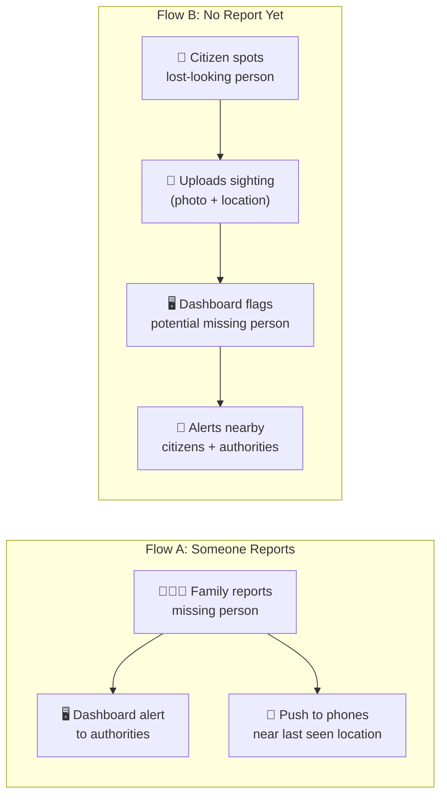
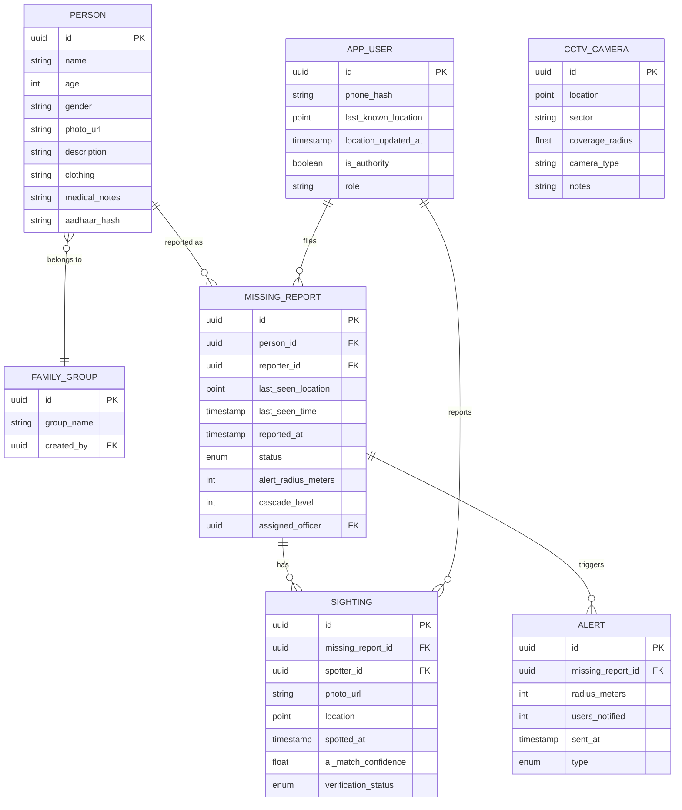
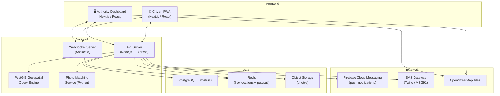

# KumbhRaksha — Simplified Implementation Plan

> **Constraint**: No hardware. Two components only:
> 1. 📱 **Citizen App** — for pilgrims with smartphones
> 2. 🖥️ **Authority Dashboard** — for police, admin, and volunteers
>
> Everything else is software, data, and the phones people already carry.

---

## Core Philosophy

The insight is simple: **at 17 million people per day, even a fraction with smartphones creates the largest search network in history.** You don't need wristbands, beacons, or special hardware. You need to turn every phone into a node in a living, breathing missing-persons network.

Two flows:



**Flow A** = reactive (someone is reported missing)
**Flow B** = proactive (someone *looks* lost but hasn't been reported — a crying child, a confused elderly person)

---

## The Two Components

### Component 1: Citizen App (📱)

A lightweight PWA (Progressive Web App) that works on any smartphone browser — **no app store download needed**. Pilgrims access it via QR codes plastered at entry points, on posters, and shared via WhatsApp.

#### Screens:

**1. Home / Alert Feed**
- Live feed of missing person alerts near the user's current location
- Each card: photo, name, age, description, last seen location + time, distance from user
- Sorted by proximity — closest alerts first
- Pull-to-refresh + auto-update via WebSocket

**2. Report Missing Person**
- Upload photo (camera or gallery)
- Name, age, gender, physical description
- What they're wearing (critical for visual search)
- Last seen location (auto-detect GPS or pin on map)
- Last seen time
- Relationship to reporter + reporter's phone number
- Any medical conditions or special needs
- Submit → instant case created

**3. Report a Sighting (Flow B)**
- "I see someone who looks lost" button always visible
- Take photo + auto-tag GPS location
- Optional: brief description ("elderly woman, white saree, sitting alone crying")
- Submit → goes to dashboard for triage
- If matched to existing report → instant family notification

**4. Active Alerts Map**
- Map centered on user's location
- Missing person markers with expanding radius rings
- CCTV camera locations overlaid (from your dataset) so users understand coverage
- Tap any marker → full details + "I See Them" action

**5. "I Found Them" Action**
- From any alert card, tap "I See Them"
- App opens camera for confirmation photo
- GPS auto-captured
- Option to call the family directly (privacy-masked number)
- Option to stay with them and guide authorities to your location
- Sends real-time location pin to dashboard

**6. Self-Registration (Optional)**
- Families can register group members with photos before/during the visit
- Creates a profile that makes reporting faster if someone goes missing
- Share a "family group" link so members can see each other's live location (like Google Maps sharing)

---

### Component 2: Authority Dashboard (🖥️)

A real-time web dashboard for the Integrated Command & Control Center (ICCC), police stations, and mobile patrol teams.

#### Views:

**1. Live Operations Map**
- Full map of the Mela area with layers:
  - 🔴 Active missing person cases (pulsing markers)
  - 🟡 Unverified sightings (Flow B reports)
  - 📸 CCTV camera locations (from your dataset)
  - 👮 Field responder locations
  - 🌡️ Crowd density heatmap (from anonymized app user locations)
- Click any case → full details panel slides in

**2. Missing Persons Command Center**
- Table of all active cases sortable by: time reported, age (children first), status
- Status pipeline: `Reported → Searching → Sighting Received → Verification → Reunited` or `Escalated`
- Each case shows:
  - All citizen sightings linked to it
  - Alert radius and how many phones were notified
  - Timeline of all actions taken
  - Assigned responder(s)
- Bulk actions: escalate, broadcast to wider area, close case

**3. Alert Broadcast Controls**
- Manual broadcast: select area on map → push alert to all app users in that zone
- Adjust alert radius for any case
- Trigger SMS blast for critical cases (children under 10, medical emergencies)
- Schedule PA announcements (manual — authority calls the PA team)

**4. Sighting Triage Queue**
- Incoming Flow B sightings that need review
- AI-assisted matching: "This sighting looks 78% similar to Case #1247"
- One-click: Match to existing case / Create new case / Dismiss
- Photo comparison side-by-side

**5. Analytics Dashboard**
- Active cases by zone, age group, time of day
- Average time to reunion
- Heatmap of where people get lost most frequently
- Crowd density trends over time
- App adoption metrics (how many active users per zone)

**6. CCTV Coverage Intelligence**
- Your CCTV dataset plotted on the map
- Voronoi diagram showing each camera's coverage zone
- Blind spot analysis → "These areas have no camera coverage"
- When a missing person's last known location is in a blind spot, dashboard highlights: "⚠️ No CCTV coverage — increase volunteer presence"
- Suggested patrol routes through blind spots

---

## The Alert Cascade (Detailed)

When a missing person is reported, the system doesn't just send one notification. It runs a **time-based expanding cascade**:

```
┌─────────────────────────────────────────────────────────────┐
│                    ALERT CASCADE TIMELINE                     │
├──────────┬──────────────────────────────────────────────────┤
│  0 min   │ 📱 Push notification to app users within 500m    │
│          │ 🖥️ Case appears on dashboard with alarm           │
│          │ 📸 Dashboard highlights nearby CCTV cameras       │
│          │    (authorities can check those feeds manually)   │
├──────────┼──────────────────────────────────────────────────┤
│  5 min   │ 📱 Alert radius expands to 1 km                  │
│          │ 📱 Alert card promoted to TOP of all nearby feeds │
│          │ 🖥️ Dashboard marks case as "Priority"             │
├──────────┼──────────────────────────────────────────────────┤
│  15 min  │ 📱 Alert radius expands to 2 km (full sector)    │
│          │ 📲 SMS sent to all registered users in sector     │
│          │ 🖥️ Case auto-escalated to senior officer          │
├──────────┼──────────────────────────────────────────────────┤
│  30 min  │ 📱 Mela-wide alert for children/elderly          │
│          │ 🖥️ Cross-reference with hospital admissions       │
│          │ 🖥️ Auto-generate social media post for sharing    │
├──────────┼──────────────────────────────────────────────────┤
│  60 min  │ 🚨 Full escalation                               │
│          │ 📱 Cell broadcast (if authority approves)         │
│          │ 🖥️ Case flagged for police investigation          │
└──────────┴──────────────────────────────────────────────────┘
```

> [!IMPORTANT]
> The cascade is **automatic** but **overridable**. Authorities can manually accelerate it (e.g., immediately go to mela-wide for a missing toddler) or slow it down (e.g., teenager who's probably just exploring).

---

## CCTV Dataset Utilization

You don't have feeds, but the **location data alone** powers critical intelligence:

### What We Build:

1. **Coverage Map Layer**
   - Plot every camera on the map with estimated coverage radius (based on camera type if available, otherwise default 50m)
   - Color-code by density: green (good coverage) → red (sparse)

2. **Blind Spot Heatmap**
   - Inverse of coverage → areas with no cameras
   - These are the zones where missing persons are hardest to track
   - Dashboard recommends deploying field teams to these zones

3. **Smart Alert Routing**
   - When someone goes missing near a camera: "Camera coverage available — check feeds from cameras C-47, C-48, C-52"
   - When someone goes missing in a blind spot: "No camera coverage — expanding citizen alert radius by 50%, deploying nearest field team"

4. **Trajectory Suggestions**
   - Given last known location, calculate likely paths based on:
     - Nearest ghats, exits, major landmarks
     - Camera positions along those paths
     - "If they walked toward the river, they'd pass cameras C-31 and C-35"

5. **Planning Tool (for next event)**
   - Show where people got lost most vs. where cameras are
   - Recommend new camera placements to close gaps

---

## Crowd Density from App Data

No hardware needed — **app users' anonymized locations become your crowd sensor**:

```
If 1% of crowd has the app and you see 500 app users in Zone A:
→ Estimated real crowd in Zone A ≈ 50,000
```

- Dashboard shows live density heatmap extrapolated from app user distribution
- Alert authorities when a zone exceeds density thresholds
- Historical density data helps predict tomorrow's hotspots
- Push "avoid this area" suggestions to app users in real-time

> [!TIP]
> This gets more accurate as adoption grows. Even at 0.5% adoption across 17M daily visitors, that's **85,000 data points** — plenty for zone-level density estimation.

---

## Data Model



---

## Technical Architecture



### Tech Stack

| Layer | Technology | Why |
|---|---|---|
| **Citizen App** | Next.js PWA | Works in browser, installable, offline-capable, no app store |
| **Dashboard** | Next.js + Leaflet/MapLibre | Real-time map with WebSocket updates |
| **Backend API** | Node.js + Express + Socket.io | Event-driven, real-time, JS fullstack |
| **Database** | PostgreSQL + PostGIS | `ST_DWithin()` for "find all users within X meters" — the core query |
| **Cache/Pub-Sub** | Redis | Live location store + alert fan-out |
| **Push Notifications** | Firebase Cloud Messaging | Free, works on all Android + modern browsers |
| **SMS** | MSG91 or Twilio | For cascade level 3+ alerts |
| **Photos** | Cloudinary or S3 | CDN-backed image storage with auto-optimization |
| **Maps** | Leaflet + OpenStreetMap | Free, offline-cacheable, no API limits |
| **Hosting** | Vercel (frontend) + Railway/Render (backend) | Fast deployment, auto-scaling |

---

## Build Plan

### Phase 1: Core Missing Persons System (Week 1-2)
- [ ] Set up Next.js project with PWA configuration
- [ ] Build citizen app: report missing person, alert feed, "I see them" action
- [ ] Build authority dashboard: live map, case management, alert controls
- [ ] Implement geospatial alert engine (PostGIS proximity queries)
- [ ] WebSocket real-time updates
- [ ] Push notification system via FCM

### Phase 2: CCTV Intelligence & Sightings (Week 3)
- [ ] Import and visualize CCTV location dataset on map
- [ ] Build coverage/blind spot analysis
- [ ] Implement Flow B: proactive sighting reports
- [ ] Photo matching UI (side-by-side comparison on dashboard)
- [ ] Alert cascade automation (timed radius expansion)

### Phase 3: Crowd Intelligence & Polish (Week 4)
- [ ] Crowd density estimation from app user locations
- [ ] Analytics dashboard (reunion times, hotspots, trends)
- [ ] SMS integration for escalated alerts
- [ ] Offline support for citizen app
- [ ] Performance optimization and load testing

---

## Open Questions

> [!IMPORTANT]
> **CCTV Dataset**: What format is your CCTV location data in? (CSV, JSON, GeoJSON?) What fields does it contain — lat/lng, camera ID, sector name, etc.?

> [!IMPORTANT]
> **Build Target**: Is this for a hackathon demo, a government pitch, or production? This determines whether we build a fully functional backend or a polished frontend with simulated data.

> [!IMPORTANT]
> **Scope**: Should we build both the citizen app and dashboard together, or focus on one first? I'd recommend building them in parallel since they share the same backend.
