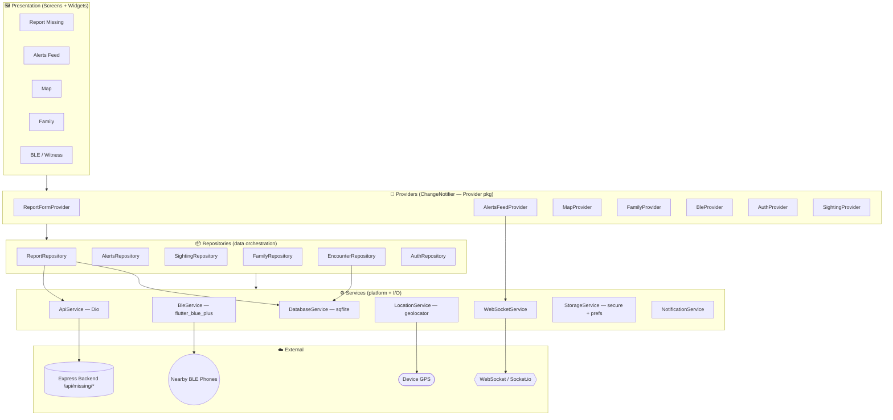
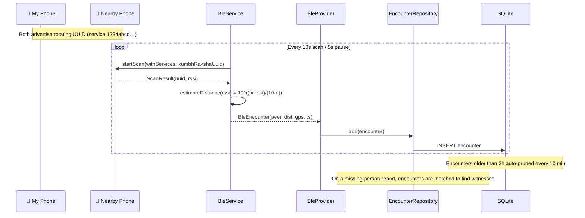
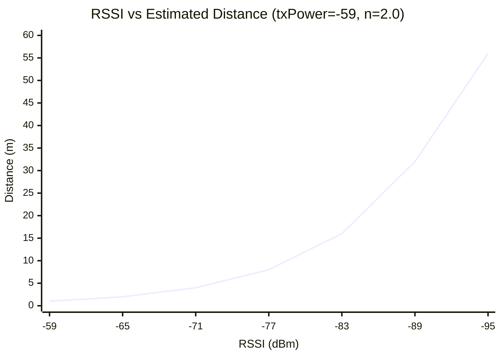
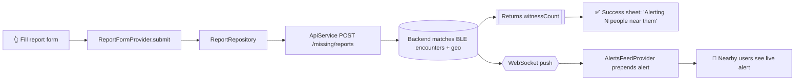
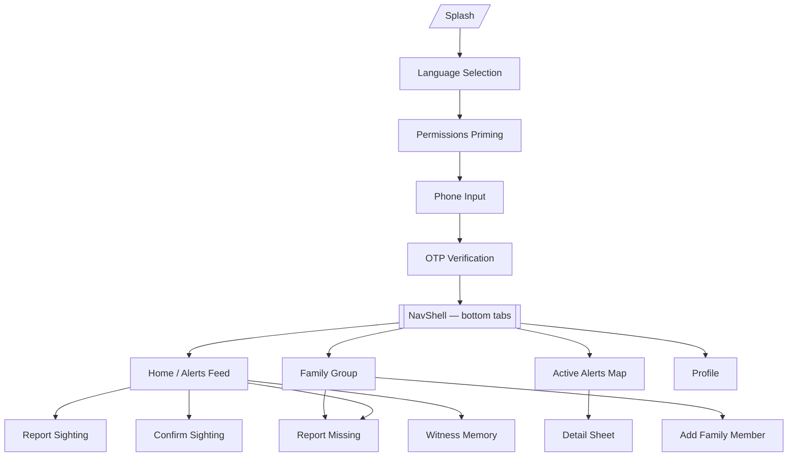
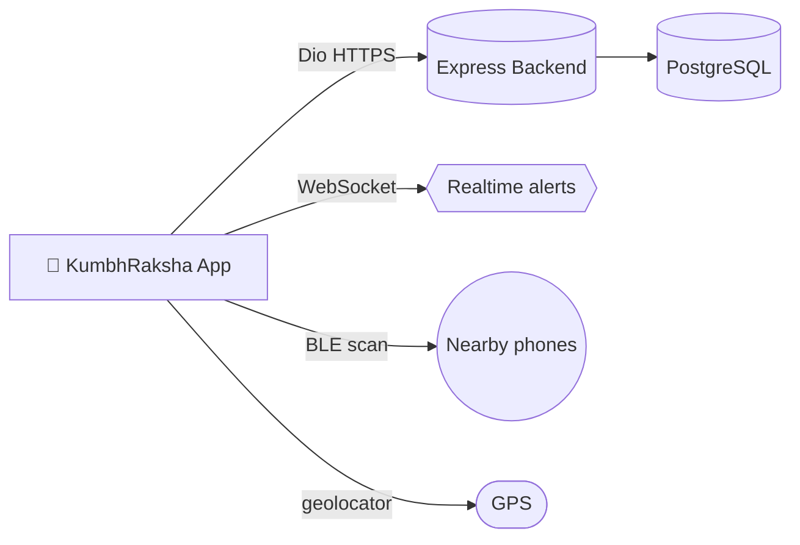
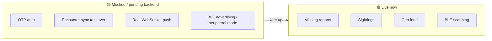

# 🛕 KumbhRaksha — Mobile App

> **Missing-person search & reunion for Kumbh Mela pilgrims.**
> A Flutter app that turns every attendee's phone into a passive **Bluetooth witness node**, so that when someone goes missing the system can instantly alert the people who were physically near them — not just broadcast blindly to the whole crowd.

[](https://flutter.dev)
[](https://dart.dev)
[](https://pub.dev/packages/provider)
[](https://m3.material.io)

---

## 📑 Table of Contents

1. [What the App Does](#-what-the-app-does)
2. [Feature List (in detail)](#-feature-list-in-detail)
3. [System Architecture](#-system-architecture)
4. [The Bluetooth (BLE) Witness Engine](#-the-bluetooth-ble-witness-engine)
5. [End-to-End Data Flow](#-end-to-end-data-flow)
6. [Screen Map & Navigation](#-screen-map--navigation)
7. [State Management Layer](#-state-management-layer)
8. [Backend Connections & API Contract](#-backend-connections--api-contract)
9. [Real-Time Alerts (WebSocket)](#-real-time-alerts-websocket)
10. [Local Persistence](#-local-persistence)
11. [Theming](#-theming)
12. [Project Structure](#-project-structure)
13. [Getting Started](#-getting-started)
14. [Configuration](#-configuration)
15. [Permissions](#-permissions)
16. [Roadmap / What's Mocked](#-roadmap--whats-mocked)

---

## 🎯 What the App Does

In a crowd of millions, a lost child or elder is a needle in a haystack. KumbhRaksha addresses this with a layered detection strategy:

| Layer | Mechanism | Strength |
|-------|-----------|----------|
| **Proximity** | Bluetooth Low Energy encounter logging between phones | Finds *who was physically near* the missing person |
| **Crowd-sourced** | Citizen "I saw them" sighting reports with photo + GPS | Human eyes across the venue |
| **Geo-feed** | Server-ranked feed of active alerts near *your* location | Surfaces what's relevant to you |
| **Family graph** | Pre-registered family groups for instant one-tap reporting | Removes friction in a panic |

---

## 🧩 Feature List (in detail)

### 🔵 1. Bluetooth (BLE) Proximity Witnessing — *the core differentiator*
- **Passive encounter logging.** The app continuously scans for other KumbhRaksha phones advertising a shared service UUID (`1234abcd-…`). Each discovery is recorded as a `BleEncounter` (peer UUID, RSSI, estimated distance, timestamp, your GPS at the time).
- **RSSI → distance estimation.** Signal strength is converted to meters using the log-distance path-loss model:
  `distance = 10 ^ ((txPower − rssi) / (10 · n))` where `txPower = −59 dBm`, `n = 2.0`.
- **Human-readable signal labels** — `Excellent` (> −70), `Good` (> −80), `Fair` (> −90), `Poor` otherwise.
- **Privacy via rotating UUIDs.** Each device advertises a UUID that **rotates every 15 minutes** (with a 5-minute grace overlap) so peers can't be tracked long-term.
- **Duty-cycled scanning.** 10 s scan session / 5 s pause to conserve battery.
- **Rolling 2-hour encounter window** with automatic cleanup every 10 minutes; the in-memory recent list is capped at 50 entries.
- **Permission-aware** — requests `bluetoothScan`, `bluetoothConnect`, and `locationWhenInUse` before starting.
- > ⚠️ **Platform note:** `flutter_blue_plus` is central-only. Scanning is fully functional; **advertising (peripheral mode) is a logged stub** and needs a dedicated peripheral plugin (e.g. `flutter_ble_peripheral`) on Android to broadcast the rotating UUID.

### 🟠 2. Report a Missing Person
- Full structured form: recent photo (camera capture), name, age, gender, physical description, **last-known clothing** (flagged as critical), date/time last seen, and location.
- **Auto-detect location** via GPS, with a map-preview card.
- Optional **medical conditions / special needs** section (dementia, autism, medication) toggled on demand.
- Reporter contact + relationship captured; phone pre-filled from the signed-in user.
- On submit, the server estimates and returns **how many nearby witnesses** were alerted.

### 🟢 3. Report a Sighting
- "I saw this person" flow with photo, GPS, and notes.
- Feeds the same `/missing/sightings` endpoint and updates the alert's status.

### 🔴 4. Real-Time Alert Feed
- Geo-sorted, **paginated** feed of active missing-person alerts near you (`/missing/feed`).
- **Live updates over WebSocket** — new alerts are prepended without a refresh.
- Infinite scroll with `hasMore` paging.

### 🗺️ 5. Active Alerts Map
- Custom-painted map view with alert + sighting markers (`MarkerKind`), detail sheets per marker.

### 👁️ 6. Witness Memory & Confirm Sighting
- When you're identified as a possible witness, a guided **"do you remember seeing them?"** flow lets you confirm/deny and attach location.

### 👨‍👩‍👧 7. Family Groups
- Pre-register family members (name, photo, age, relationship).
- One-tap **quick report** that pre-seeds the missing-person form from a family member's profile.

### 🔐 8. Authentication & Onboarding
- Language selection → permissions priming → **phone + OTP** verification.
- JWT access/refresh tokens stored in secure storage; auto-refresh on 401.

### 👤 9. Profile
- User identity, status, and settings surface.

### 🌗 10. Adaptive Theming
- Full **Material 3** light + dark themes that follow the system setting, with a tactical brand palette. *(See [Theming](#-theming).)*

---

## 🏗 System Architecture

Clean, layered, unidirectional. UI never talks to the network directly — it goes **Screen → Provider → Repository → Service**.



---

## 🔵 The Bluetooth (BLE) Witness Engine

This is the heart of KumbhRaksha. Here's how a passive encounter becomes actionable evidence.



### BLE configuration reference (`ble_constants.dart`)

| Constant | Value | Purpose |
|----------|-------|---------|
| `kumbhRakshaServiceUuid` | `1234abcd-e567-89ab-cdef-0123456789ab` | Shared identity all app phones scan for |
| `advertisingIntervalMs` | `4000` | Broadcast cadence |
| `scanSession` / `scanPause` | `10s` / `5s` | Battery-friendly duty cycle |
| `rotationInterval` / `gracePeriod` | `15 min` / `5 min` | Anti-tracking UUID rotation |
| `txPowerDbm` | `−59` | Calibrated 1 m reference signal |
| `pathLossExponent` | `2.0` | Free-space-ish environment factor |
| `rssiThreshold` | `−120` | Floor below which readings are discarded |
| `encounterWindow` / `cleanupInterval` | `2h` / `10 min` | Retention + GC |

### Signal strength → distance (illustrative)



---

## 🔄 End-to-End Data Flow

A missing-person report, from tap to witness alert:



---

## 🧭 Screen Map & Navigation



**Registered routes** (`main.dart`): `/splash`, `/language`, `/permissions`, `/phone`, `/otp`, `/shell`, `/report`, `/report-sighting`, `/family`, `/add-family-member`.

---

## 🔄 State Management Layer

All state is **Provider / `ChangeNotifier`** (per project standards — no BLoC, no classes-as-widgets). Composition root is `main.dart`, where services are constructed once and injected into providers via repositories.

| Provider | Responsibility | Talks to |
|----------|----------------|----------|
| `AuthProvider` | Session, OTP, tokens | `AuthRepository` |
| `BleProvider` | Scan lifecycle, recent encounters | `BleService`, `EncounterRepository` |
| `ReportFormProvider` | Missing-person form + submit + location capture | `ReportRepository`, `LocationService` |
| `AlertsFeedProvider` | Paginated feed + live WS alerts | `AlertsRepository`, `WebSocketService`, `LocationService` |
| `SightingProvider` | Sighting capture/submit | `SightingRepository`, `LocationService` |
| `MapProvider` | Markers, map state | `LocationService` |
| `FamilyProvider` | Family group CRUD | `FamilyRepository` |

---

## 🌐 Backend Connections & API Contract

The single source of truth is the centralized **Express web/backend**. Base URL in `api_constants.dart`.

> **Emulator tip:** use `http://10.0.2.2:5001/api` for the Android emulator (maps to host localhost); use the LAN IP for a physical device.

| Domain | Method | Endpoint | Status |
|--------|--------|----------|--------|
| Auth | POST | `/auth/register` | 🟡 Mocked |
| Auth | POST | `/auth/verify-otp` | 🟡 Mocked |
| Auth | POST | `/auth/refresh` | 🟡 Mocked |
| User | GET | `/users/me` | 🟡 Mocked |
| User | POST | `/users/fcm-token` | 🟡 Mocked |
| Reports | POST/GET | `/missing/reports` | 🟢 Live |
| Sightings | POST | `/missing/sightings` | 🟢 Live |
| Feed | GET | `/missing/feed` | 🟢 Live (geo-sorted) |
| Encounters | POST | `/encounters` | 🟡 Mocked (local SQLite for now) |

`ApiService` (Dio) handles base URL, `connectTimeout = 15s`, `receiveTimeout = 20s`, JWT injection, and 401 → refresh.



---

## 📡 Real-Time Alerts (WebSocket)

`WebSocketService` powers the live feed.

- **Mock mode (default)** emits simulated alerts on a timer so the feed animates during demos.
- **Live mode** connects with the JWT, parses inbound `alert` events into `WitnessAlert`, and **reconnects with exponential backoff**.
- `AlertsFeedProvider` subscribes and prepends each inbound alert to the list.

---

## 💾 Local Persistence

| Store | Tech | Used for |
|-------|------|----------|
| Secure storage | `flutter_secure_storage` | Access/refresh tokens, BLE base UUID |
| Preferences | `shared_preferences` | Onboarding flag, language, last lat/lng, user id |
| SQLite | `sqflite` | BLE encounter log, report cache |

---

## 🎨 Theming

Material 3 light **and** dark themes (`core/theme/`), following `ThemeMode.system`.

- **Brand accents** (mode-independent): orange `#FF801F`, yellow `#FFC53D`, blue `#3B9EFF`, green `#11FF99`, red `#FF2047`.
- Light surface = white; Dark surface = true black with 86% silver text.
- **Inputs are theme-aware** — fields use `surfaceDim` for fill and `onSurface` for typed text, so text stays legible (white-on-dark in dark mode, dark-on-light in light mode). Earlier hardcoded light fills that caused invisible white text in the report & sighting forms have been replaced with scheme-derived colors.

---

## 📂 Project Structure

```
lib/
├── main.dart                      # Composition root + MaterialApp + routes
├── core/
│   ├── constants/                 # api, app, ble, dimensions, durations
│   ├── theme/                     # app_theme, color_scheme, text_theme
│   └── utils/                     # logger, translations, distance, validators
├── models/                        # ble_encounter, missing_report, sighting, user…
├── providers/                     # ChangeNotifier state holders
├── repositories/                  # data orchestration + API mapping
├── services/                      # api, ble, websocket, location, db, storage, notif
├── features/                      # feature-first screens & widgets
│   ├── auth/   ├── alerts/   ├── family/   ├── map/
│   ├── profile/   ├── report/   └── sightings/
├── screens/                       # splash, nav_shell
└── widgets/                       # shared cards
```

---

## 🚀 Getting Started

```bash
# 1. Install dependencies
flutter pub get

# 2. Start the Express backend (separate repo) on :5001

# 3. Point the app at your backend
#    edit lib/core/constants/api_constants.dart (baseUrl)

# 4. Run
flutter run                      # connected device
flutter run -d emulator-5554     # Android emulator (use 10.0.2.2 baseUrl)
```

**Quality gates**

```bash
flutter analyze
flutter test
```

---

## ⚙️ Configuration

| What | Where |
|------|-------|
| Backend base URL | `lib/core/constants/api_constants.dart` |
| BLE timings & UUID | `lib/core/constants/ble_constants.dart` |
| Live vs mock repos | `main.dart` (`mockMode:` flags + `WebSocketService(mockMode:)`) |
| Storage keys | `lib/core/constants/app_constants.dart` |

---

## 🔐 Permissions

| Permission | Why |
|------------|-----|
| `bluetoothScan`, `bluetoothConnect` | Discover nearby witness phones |
| `locationWhenInUse` | Required by Android for BLE scans + tagging encounters/reports |
| Camera | Capturing missing-person / sighting photos |

---

## 🗺 Roadmap / What's Mocked



- [ ] Replace mocked OTP auth with live `/auth/*`.
- [ ] Sync local SQLite encounters to `/encounters` for server-side witness matching.
- [ ] Switch `WebSocketService` off mock mode against the production Socket.io server.
- [ ] Add an Android peripheral plugin so phones can **advertise** (not just scan) the rotating UUID.

---

<sub>Built with Flutter • Provider • Material 3 — for safer pilgrimages. 🙏</sub>
